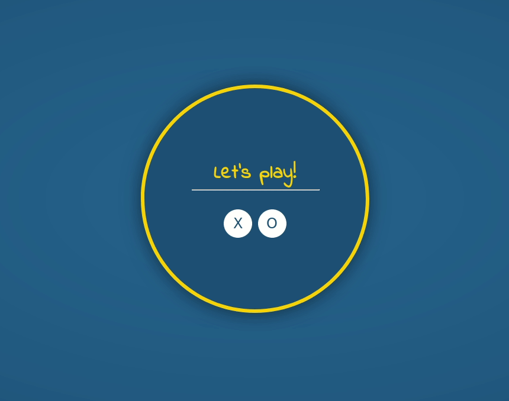

# TicTacToe Game
#### Project made for the old freeCodeCamp curriculum

Another project made for the FreeCodeCamp certificate. The new curriculum, starting on June 2018, no longer requires this coding project, but it was really fun coding this game.

I used React and CSS/SVG for the animations.

#### Screenshot

This is how it looks like.

#### User Stories

These are the requirements for this project. They are all fullfilled.

1. I can play a game of Tic Tac Toe with the computer.
2. My game will reset as soon as it's over so I can play again.
3. I can choose whether I want to play as X or O.

---

[Yago Estévez](https://twitter.com/yagoestevez)